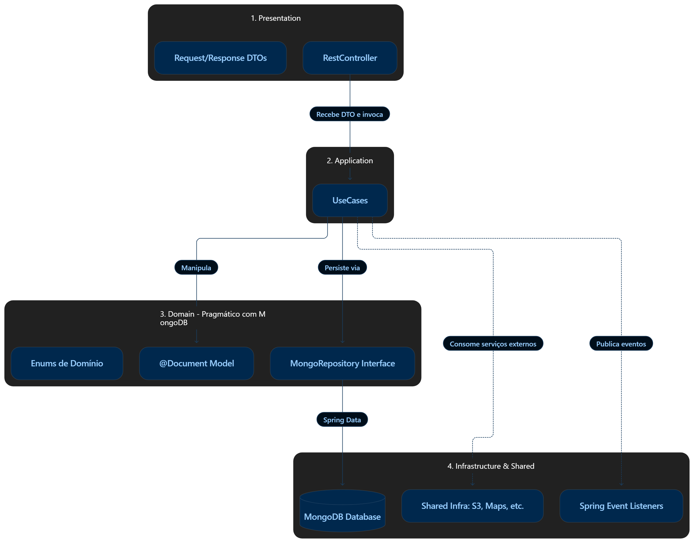
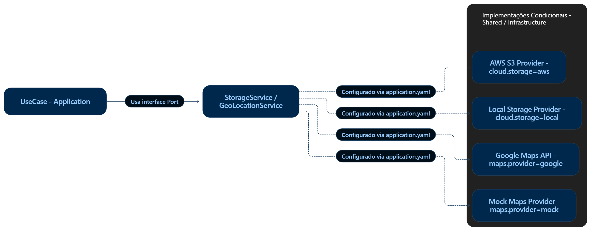

# Arquitetura Backend: Monólito Modular com Spring Boot e MongoDB

## 1. Visão Geral

Este documento descreve a arquitetura oficial do backend do projeto **Converge**. O sistema adota o padrão de **Monólito Modular** (_Modular Monolith_), orientado a conceitos de **Arquitetura Hexagonal (Ports & Adapters)** com **Spring Boot** e **MongoDB** como banco de dados orientado a documentos.

A meta desta arquitetura é garantir:

- **Alta Coesão e Baixo Acoplamento:** Cada módulo de negócio é autônomo e isolado.
- **Simplicidade de Operação:** Único artefato de deploy e infraestrutura simples.
- **Flexibilidade de Provedores Externos:** Integrações com nuvem e serviços externos (Firebase Storage, Firebase Auth, Google Maps) desacopladas por interfaces, alternáveis diretamente via `application.yaml`.
- **Pragmatismo com MongoDB:** Uso nativo de documentos e repositórios do Spring Data, eliminando mapeamentos desnecessários e complexidades relacionais.

---

## 2. Estrutura Geral de Pastas e Pacotes

A aplicação reside no diretório `app/converge-backend` e tem como pacote raiz `com.converge.api`. Ela é dividida em dois grandes blocos: **`modules/`** (funcionalidades de negócio) e **`shared/`** (recursos transversais e infraestrutura compartilhada).

```text
app/converge-backend/src/main/java/com/converge/api/
│
├── ConvergeBackendApplication.java             # Inicializador do Spring Boot
│
├── modules/                                    # Domínios de Negócio (Bounded Contexts)
│   │
│   └── {nomeModulo}/                           # Ex: usuario, carona, etc.
│       ├── application/                        # Casos de Uso (Orquestração de regras)
│       │   └── {moduloUseCase}                 # Classes UseCase (ex: CriarUsuarioUseCase)
│       │
│       ├── domain/                             # Núcleo de Domínio
│       │   ├── enums/                          # Enums de negócio (ex: PerfilUsuario, StatusCarona)
│       │   ├── model/                          # Entidades Documento (@Document)
│       │   └── repository/                     # Interfaces MongoRepository
│       │
│       ├── infrastructure/                     # Adaptadores e integrações do módulo
│       │   ├── listener/                       # Ouvintes de eventos internos do Spring
│       │   └── client/                         # Feign/WebClient específicos do módulo
│       │
│       └── presentation/                       # Porta de entrada HTTP
│           ├── controller/                     # Controladores REST (@RestController)
│           └── dtos/                           # DTOs de Request e Response da API
│
└── shared/                                     # Recursos Transversais e Infraestrutura
    ├── config/                                 # Configurações globais (MongoConfig, Swagger, CORS, FirebaseConfig)
    ├── exception/                              # Tratamento global de erros e exceções base
    ├── security/                               # Segurança, filtros de autenticação e contexto de usuário
    └── infrastructure/                         # Portas e Adaptadores de Nuvem / APIs Externas
        ├── auth/                               # Provedor de Autenticação (Firebase Auth / Mock)
        ├── storage/                            # Provedor de Armazenamento/Upload (Firebase Storage / Local)
        └── maps/                               # Provedor de Geolocalização (Google Maps / Mock)
```

---

## 3. Responsabilidades das Camadas nos Módulos (`modules/{nomeModulo}`)



### 3.1. `domain/` (Abordagem Pragmática com MongoDB)

O MongoDB não possui o rigor de tabelas relacionais ou impedâncias de ORMs clássicos. Por isso, adota-se a **abordagem pragmática**:

- **Documentos (`@Document`):** As entidades de domínio contêm as anotações do Spring Data Mongo (`@Document`, `@Id`, `@Indexed`).
- **Repositórios:** Interfaces que estendem diretamente `MongoRepository<T, ID>`, permitindo queries por convenção e consultas `@Query`.
- **Enums:** Estados e tipos imutáveis do domínio.

**Exemplo (`domain/model/Usuario.java`):**

```java
package com.converge.api.modules.usuario.domain.model;

import com.converge.api.modules.usuario.domain.enums.PerfilUsuario;
import org.springframework.data.annotation.Id;
import org.springframework.data.mongodb.core.index.Indexed;
import org.springframework.data.mongodb.core.mapping.Document;

import java.time.Instant;

@Document(collection = "usuarios")
public class Usuario {

    @Id
    private String id;

    private String nome;

    @Indexed(unique = true)
    private String email;

    private PerfilUsuario perfil;

    private String fotoUrl;

    private Instant criadoEm;

    public Usuario(String nome, String email, PerfilUsuario perfil) {
        this.nome = nome;
        this.email = email;
        this.perfil = perfil;
        this.criadoEm = Instant.now();
    }

    // Getters e métodos de negócio
    public void atualizarFoto(String url) {
        this.fotoUrl = url;
    }

    public String getId() { return id; }
    public String getNome() { return nome; }
    public String getEmail() { return email; }
    public PerfilUsuario getPerfil() { return perfil; }
    public String getFotoUrl() { return fotoUrl; }
    public Instant getCriadoEm() { return criadoEm; }
}
```

**Exemplo (`domain/repository/UsuarioRepository.java`):**

```java
package com.converge.api.modules.usuario.domain.repository;

import com.converge.api.modules.usuario.domain.model.Usuario;
import org.springframework.data.mongodb.repository.MongoRepository;
import org.springframework.stereotype.Repository;

import java.util.Optional;

@Repository
public interface UsuarioRepository extends MongoRepository<Usuario, String> {
    Optional<Usuario> findByEmail(String email);
    boolean existsByEmail(String email);
}
```

---

### 3.2. `application/` (Casos de Uso)

- Orquestra as regras de negócio.
- Não lida diretamente com HTTP (não conhece `HttpServletRequest`, `HttpStatus`, etc.).
- Invoca o `Repository` do módulo e interfaces de infraestrutura necessárias (como autenticação, upload de arquivos ou geolocalização).

**Exemplo (`application/usecase/CriarUsuarioUseCase.java`):**

```java
package com.converge.api.modules.usuario.application.usecase;

import com.converge.api.modules.usuario.domain.enums.PerfilUsuario;
import com.converge.api.modules.usuario.domain.model.Usuario;
import com.converge.api.modules.usuario.domain.repository.UsuarioRepository;
import com.converge.api.shared.exception.NegocioException;
import org.springframework.stereotype.Service;

@Service
public class CriarUsuarioUseCase {

    private final UsuarioRepository usuarioRepository;

    public CriarUsuarioUseCase(UsuarioRepository usuarioRepository) {
        this.usuarioRepository = usuarioRepository;
    }

    public Usuario executar(String nome, String email, PerfilUsuario perfil) {
        if (usuarioRepository.existsByEmail(email)) {
            throw new NegocioException("E-mail já cadastrado na plataforma.");
        }

        Usuario novoUsuario = new Usuario(nome, email, perfil);
        return usuarioRepository.save(novoUsuario);
    }
}
```

---

### 3.3. `presentation/` (Controllers e DTOs)

- Ponto de contato com o cliente (Frontend Flutter / Mobile).
- **`dtos/`**: Records Java que representam o corpo de requisições de entrada (_Requests_) com anotações de validação (`jakarta.validation`), e respostas de saída (_Responses_).
- **`controller/`**: Endpoints REST anotados com `@RestController` que validam a entrada, delegam a execução para o Use Case correspondente e mapeiam a resposta para o DTO de saída.

**Exemplo DTOs (`presentation/dtos/`):**

```java
package com.converge.api.modules.usuario.presentation.dtos;

import com.converge.api.modules.usuario.domain.enums.PerfilUsuario;
import jakarta.validation.constraints.Email;
import jakarta.validation.constraints.NotBlank;
import jakarta.validation.constraints.NotNull;

public record CriarUsuarioRequestDTO(
    @NotBlank(message = "O nome é obrigatório")
    String nome,

    @NotBlank(message = "O email é obrigatório")
    @Email(message = "E-mail inválido")
    String email,

    @NotNull(message = "O perfil é obrigatório")
    PerfilUsuario perfil
) {}
```

```java
package com.converge.api.modules.usuario.presentation.dtos;

import com.converge.api.modules.usuario.domain.enums.PerfilUsuario;
import com.converge.api.modules.usuario.domain.model.Usuario;

public record UsuarioResponseDTO(
    String id,
    String nome,
    String email,
    PerfilUsuario perfil,
    String fotoUrl
) {
    public static UsuarioResponseDTO from(Usuario usuario) {
        return new UsuarioResponseDTO(
            usuario.getId(),
            usuario.getNome(),
            usuario.getEmail(),
            usuario.getPerfil(),
            usuario.getFotoUrl()
        );
    }
}
```

**Exemplo Controller (`presentation/controller/UsuarioController.java`):**

```java
package com.converge.api.modules.usuario.presentation.controller;

import com.converge.api.modules.usuario.application.usecase.CriarUsuarioUseCase;
import com.converge.api.modules.usuario.domain.model.Usuario;
import com.converge.api.modules.usuario.presentation.dtos.CriarUsuarioRequestDTO;
import com.converge.api.modules.usuario.presentation.dtos.UsuarioResponseDTO;
import jakarta.validation.Valid;
import org.springframework.http.HttpStatus;
import org.springframework.http.ResponseEntity;
import org.springframework.web.bind.annotation.*;

@RestController
@RequestMapping("/api/v1/usuarios")
public class UsuarioController {

    private final CriarUsuarioUseCase criarUsuarioUseCase;

    public UsuarioController(CriarUsuarioUseCase criarUsuarioUseCase) {
        this.criarUsuarioUseCase = criarUsuarioUseCase;
    }

    @PostMapping
    public ResponseEntity<UsuarioResponseDTO> criar(@RequestBody @Valid CriarUsuarioRequestDTO request) {
        Usuario usuario = criarUsuarioUseCase.executar(request.nome(), request.email(), request.perfil());
        return ResponseEntity.status(HttpStatus.CREATED).body(UsuarioResponseDTO.from(usuario));
    }
}
```

---

### 3.4. `infrastructure/` (Dentro do Módulo)

Destinada a componentes específicos do módulo que lidam com detalhes de sistema ou eventos:

- Ouvintes de eventos do Spring (`@EventListener` ou `@TransactionalEventListener`).
- Clients HTTP Feign ou WebClient específicos do módulo para comunicação com outros serviços.

---

## 4. Camada Compartilhada (`shared/`) e Suporte a Múltiplas Implementações via `application.yaml`

Para viabilizar a troca de provedores de nuvem ou APIs externas alterando apenas o arquivo `application.yaml`, utiliza-se o padrão **Ports and Adapters** com anotações `@ConditionalOnProperty` do Spring.



---

### 4.1. Provedor de Armazenamento de Arquivos: Firebase Storage vs Local (exemplo)

#### 1. A Porta / Interface (`shared/infrastructure/storage/contract/StorageService.java`):

```java
package com.converge.api.shared.infrastructure.storage.contract;

import java.io.InputStream;

public interface StorageService {
    String upload(String nomeArquivo, String contentType, InputStream dados, long tamanho);
    void remover(String arquivoUrl);
}
```

#### 2. Implementação Firebase Storage (`shared/infrastructure/storage/impl/FirebaseStorageService.java`):

Ativada quando `app.storage.provider=firebase`:

```java
package com.converge.api.shared.infrastructure.storage.impl;

import com.converge.api.shared.infrastructure.storage.contract.StorageService;
import com.google.cloud.storage.Blob;
import com.google.cloud.storage.Bucket;
import com.google.firebase.cloud.StorageClient;
import org.springframework.beans.factory.annotation.Value;
import org.springframework.boot.autoconfigure.condition.ConditionalOnProperty;
import org.springframework.stereotype.Service;

import java.io.InputStream;

@Service
@ConditionalOnProperty(name = "app.storage.provider", havingValue = "firebase")
public class FirebaseStorageService implements StorageService {

    @Value("${app.storage.firebase.bucket-name}")
    private String bucketName;

    @Override
    public String upload(String nomeArquivo, String contentType, InputStream dados, long tamanho) {
        // Realiza o upload do arquivo para o Firebase Storage / Google Cloud Storage
        Bucket bucket = StorageClient.getInstance().bucket(bucketName);
        Blob blob = bucket.create(nomeArquivo, dados, contentType);
        return String.format("https://firebasestorage.googleapis.com/v0/b/%s/o/%s?alt=media", bucketName, nomeArquivo);
    }

    @Override
    public void remover(String arquivoUrl) {
        // Remove o blob do bucket Firebase Storage
        Bucket bucket = StorageClient.getInstance().bucket(bucketName);
        // Lógica de extração do nome do objeto e deleção: bucket.get(nomeArquivo).delete();
    }
}
```

#### 3. Implementação Local / Desenvolvimento (`shared/infrastructure/storage/impl/LocalStorageService.java`):

Ativada quando `app.storage.provider=local` ou se a propriedade não estiver configurada:

```java
package com.converge.api.shared.infrastructure.storage.impl;

import com.converge.api.shared.infrastructure.storage.contract.StorageService;
import org.springframework.boot.autoconfigure.condition.ConditionalOnProperty;
import org.springframework.stereotype.Service;

import java.io.InputStream;

@Service
@ConditionalOnProperty(name = "app.storage.provider", havingValue = "local", matchIfMissing = true)
public class LocalStorageService implements StorageService {

    @Override
    public String upload(String nomeArquivo, String contentType, InputStream dados, long tamanho) {
        // Salva na pasta local /uploads e retorna URL de endpoint estático
        return "http://localhost:8080/uploads/" + nomeArquivo;
    }

    @Override
    public void remover(String arquivoUrl) {
        // Remove o arquivo do disco local
    }
}
```

---

### 4.2. Provedor de Autenticação: Firebase Auth vs Mock (exemplo)

#### 1. A Porta / Interface (`shared/infrastructure/auth/contract/AuthService.java`):

```java
package com.converge.api.shared.infrastructure.auth.contract;

public interface AuthService {
    UsuarioAutenticado verificarToken(String token);

    record UsuarioAutenticado(String uid, String email, String nome) {}
}
```

#### 2. Implementação Firebase Auth (`shared/infrastructure/auth/impl/FirebaseAuthService.java`):

Ativada quando `app.auth.provider=firebase`:

```java
package com.converge.api.shared.infrastructure.auth.impl;

import com.converge.api.shared.infrastructure.auth.contract.AuthService;
import com.google.firebase.auth.FirebaseAuth;
import com.google.firebase.auth.FirebaseToken;
import org.springframework.boot.autoconfigure.condition.ConditionalOnProperty;
import org.springframework.stereotype.Service;

@Service
@ConditionalOnProperty(name = "app.auth.provider", havingValue = "firebase")
public class FirebaseAuthService implements AuthService {

    @Override
    public UsuarioAutenticado verificarToken(String token) {
        try {
            FirebaseToken decodedToken = FirebaseAuth.getInstance().verifyIdToken(token);
            return new UsuarioAutenticado(
                decodedToken.getUid(),
                decodedToken.getEmail(),
                decodedToken.getName()
            );
        } catch (Exception e) {
            throw new SecurityException("Token Firebase inválido ou expirado", e);
        }
    }
}
```

#### 3. Implementação Mock para Testes/Dev (`shared/infrastructure/auth/impl/MockAuthService.java`):

Ativada quando `app.auth.provider=mock` ou se ausente:

```java
package com.converge.api.shared.infrastructure.auth.impl;

import com.converge.api.shared.infrastructure.auth.contract.AuthService;
import org.springframework.boot.autoconfigure.condition.ConditionalOnProperty;
import org.springframework.stereotype.Service;

@Service
@ConditionalOnProperty(name = "app.auth.provider", havingValue = "mock", matchIfMissing = true)
public class MockAuthService implements AuthService {

    @Override
    public UsuarioAutenticado verificarToken(String token) {
        // Retorna usuário fictício para agilizar testes e desenvolvimento sem dependência externa
        return new UsuarioAutenticado("mock-user-123", "usuario.teste@puc-campinas.edu.br", "Usuário Teste");
    }
}
```

---

### 4.3. Provedor de Geolocalização: Google Maps API vs Mock (exemplo)

#### 1. A Porta / Interface (`shared/infrastructure/maps/contract/GeoLocationService.java`):

```java
package com.converge.api.shared.infrastructure.maps.contract;

public interface GeoLocationService {
    GeoCoordenadas obterCoordenadasPorEndereco(String endereco);
    Double calcularDistanciaKm(GeoCoordenadas origem, GeoCoordenadas destino);

    record GeoCoordenadas(double latitude, double longitude) {}
}
```

#### 2. Implementação com Google Maps (`shared/infrastructure/maps/impl/GoogleMapsService.java`):

Ativada quando `app.maps.provider=google`:

```java
package com.converge.api.shared.infrastructure.maps.impl;

import com.converge.api.shared.infrastructure.maps.contract.GeoLocationService;
import org.springframework.boot.autoconfigure.condition.ConditionalOnProperty;
import org.springframework.stereotype.Service;

@Service
@ConditionalOnProperty(name = "app.maps.provider", havingValue = "google")
public class GoogleMapsService implements GeoLocationService {

    @Override
    public GeoCoordenadas obterCoordenadasPorEndereco(String endereco) {
        // Chamada via Google Maps Geocoding API usando RestClient ou Google Maps SDK
        return new GeoCoordenadas(-22.9064, -47.0616); // Ex: Campinas/SP
    }

    @Override
    public Double calcularDistanciaKm(GeoCoordenadas origem, GeoCoordenadas destino) {
        // Chamada via Google Maps Distance Matrix API
        return 5.2;
    }
}
```

#### 3. Implementação Mock para Testes/Dev (`shared/infrastructure/maps/impl/MockMapsService.java`):

Ativada quando `app.maps.provider=mock` ou ausente:

```java
package com.converge.api.shared.infrastructure.maps.impl;

import com.converge.api.shared.infrastructure.maps.contract.GeoLocationService;
import org.springframework.boot.autoconfigure.condition.ConditionalOnProperty;
import org.springframework.stereotype.Service;

@Service
@ConditionalOnProperty(name = "app.maps.provider", havingValue = "mock", matchIfMissing = true)
public class MockMapsService implements GeoLocationService {

    @Override
    public GeoCoordenadas obterCoordenadasPorEndereco(String endereco) {
        // Retorna coordenadas fixas para testes sem gastar cota de API
        return new GeoCoordenadas(-22.8333, -47.0500);
    }

    @Override
    public Double calcularDistanciaKm(GeoCoordenadas origem, GeoCoordenadas destino) {
        return 10.0;
    }
}
```

---

### 4.4. Exemplo de Configuração no `application.yaml`

Para alternar entre nuvem e ambiente local de desenvolvimento, basta alterar os valores no arquivo de configuração:

```yaml
spring:
  application:
    name: converge-backend
  data:
    mongodb:
      uri: ${MONGODB_CONNECTION_STRING:mongodb://localhost:27017/converge_db}
      auto-index-creation: true

# Configurações de Provedores Alternáveis (Shared Infrastructure)
app:
  storage:
    provider: firebase # Opções: 'local' ou 'firebase'
    firebase:
      bucket-name: ${FIREBASE_STORAGE_BUCKET:converge-app.appspot.com}

  auth:
    provider: firebase # Opções: 'mock' ou 'firebase'

  maps:
    provider: mock # Opções: 'mock' ou 'google'
    google:
      api-key: ${GOOGLE_MAPS_API_KEY:}
```

---

## 5. Tratamento de Exceções Global (`shared/exception`)

O backend padroniza as respostas de erro usando o padrão oficial **RFC 7807 (Problem Details)** do Spring Boot:

### 5.1. Exceção Base de Negócio

```java
package com.converge.api.shared.exception;

public class NegocioException extends RuntimeException {
    private final String codigo;

    public NegocioException(String mensagem) {
        super(mensagem);
        this.codigo = "REGRA_NEGOCIO_VIOLADA";
    }

    public NegocioException(String mensagem, String codigo) {
        super(mensagem);
        this.codigo = codigo;
    }

    public String getCodigo() {
        return this.codigo;
    }
}
```

### 5.2. Manipulador Global com `@RestControllerAdvice`

```java
package com.converge.api.shared.exception;

import org.springframework.http.HttpStatus;
import org.springframework.http.ProblemDetail;
import org.springframework.web.bind.MethodArgumentNotValidException;
import org.springframework.web.bind.annotation.ExceptionHandler;
import org.springframework.web.bind.annotation.RestControllerAdvice;

import java.net.URI;
import java.time.Instant;
import java.util.HashMap;
import java.util.Map;

@RestControllerAdvice
public class GlobalExceptionHandler {

    @ExceptionHandler(NegocioException.class)
    public ProblemDetail handleNegocioException(NegocioException ex) {
        ProblemDetail problemDetail = ProblemDetail.forStatusAndDetail(HttpStatus.UNPROCESSABLE_ENTITY, ex.getMessage());
        problemDetail.setTitle("Violação de Regra de Negócio");
        problemDetail.setType(URI.create("https://converge.app/problems/business-rule"));
        problemDetail.setProperty("timestamp", Instant.now());
        problemDetail.setProperty("code", ex.getCodigo());
        return problemDetail;
    }

    @ExceptionHandler(MethodArgumentNotValidException.class)
    public ProblemDetail handleValidationException(MethodArgumentNotValidException ex) {
        ProblemDetail problemDetail = ProblemDetail.forStatusAndDetail(HttpStatus.BAD_REQUEST, "Erro de validação nos campos informados.");
        problemDetail.setTitle("Dados Inválidos");
        problemDetail.setType(URI.create("https://converge.app/problems/validation-error"));

        Map<String, String> erros = new HashMap<>();
        ex.getBindingResult().getFieldErrors().forEach(f -> erros.put(f.getField(), f.getDefaultMessage()));
        problemDetail.setProperty("errors", erros);
        problemDetail.setProperty("timestamp", Instant.now());
        problemDetail.setProperty("code", "VALIDATION_FAILED");
        return problemDetail;
    }
}
```

---

## 6. Comunicação entre Módulos

Como o sistema é um monólito com MongoDB:

1. **Isolamento de Coleções:** Cada módulo é dono de suas coleções (`collection = "usuarios"`, `collection = "caronas"`). O módulo de `caronas` **nunca** executa queries diretas na coleção `usuarios`.
2. **Referência por Identificador Simples:** Para relacionar dados entre módulos, armazena-se apenas o ID (`String usuarioId`). Não são utilizadas referências cruzadas complexas (`@DBRef`).
3. **Comunicação Síncrona:** Se um caso de uso precisa de dados de outro módulo, ele injeta e invoca o caso de uso de leitura daquele módulo (ex: `ConsultarUsuarioPorIdUseCase`), recebendo um DTO imutável.
4. **Comunicação Assíncrona por Eventos:** Para processos que geram efeitos secundários (ex: notificação ou envio de e-mail), o módulo emissor publica um evento via `ApplicationEventPublisher`, e o listener no pacote `infrastructure/listener` do módulo destinatário consome o evento.

---

## 7. Checklist para Criação de um Novo Módulo

Ao criar uma nova funcionalidade no sistema:

1. Criar a pasta do módulo em `app/converge-backend/src/main/java/com/converge/api/modules/{novoModulo}/`.
2. Criar os quatro subpacotes:
   - `application/`
   - `domain/model/`, `domain/repository/` e `domain/enums/`
   - `infrastructure/` (se houver listeners ou adaptadores específicos)
   - `presentation/controller/` e `presentation/dtos/`
3. Mapear o documento com `@Document(collection = "{novoModulo}")`.
4. Criar a interface de repositório estendendo `MongoRepository`.
5. Se necessitar de serviços de nuvem ou externos (autenticação Firebase Auth, upload no Firebase Storage, geolocalização com Maps), injetar as interfaces presentes em `com.converge.api.shared.infrastructure.*`.
