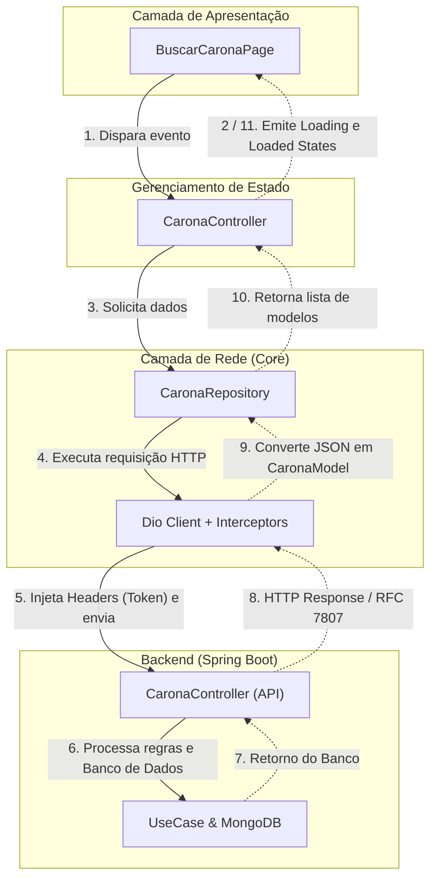

# Feature-Driven & Modular com Flutter

## 1. Visão Geral

Este documento descreve a arquitetura oficial do aplicativo móvel **Converge**, desenvolvido em **Flutter/Dart**. A arquitetura adota o padrão **Feature-Driven (Feature-First)** combinado a princípios de **Clean Architecture**, desenhada especificamente para manter simetria arquitetural direta com o backend do projeto (Monólito Modular Hexagonal com Spring Boot).

### Princípios Norteadores:

- **Simetria Arquitetural com o Backend:** Assim como o backend é dividido em `shared/` e `modules/`, o frontend é particionado em `core/` (recursos globais e transversais) e `features/` (módulos verticais de negócio).
- **Alta Coesão e Baixo Acoplamento:** Cada funcionalidade de negócio (carona, autenticação, usuário) encapsula sua própria camada de dados, regras de apresentação e componentes de interface.
- **Resiliência e Idempotência de Rede:** Estrutura de comunicação HTTP via interceptors que injetam chaves de idempotência (`Idempotency-Key`) em mutações críticas e realizam o tratamento uniforme do padrão **RFC 7807 (Problem Details)** emitido pelo Spring Boot.
- **Design System Coeso:** Centralização de temas, tipografias, paleta de cores e componentes visuais base em `core/widgets/` e `core/theme/`.
- **Previsibilidade de Estado:** Separação estrita entre a camada de apresentação pura (Widgets/Pages) e os controladores de estado/regras de tela.

---

## 2. Estrutura Geral de Diretórios (`lib/`)

A base de código da aplicação reside em `app/converge/lib` e é organizada da seguinte forma:

```text
lib/
├── core/                           # Equivalente ao "shared" do backend (transversal)
│   ├── config/                     # Configurações de ambiente (URLs, chaves de API, variáveis)
│   ├── network/                    # Cliente HTTP (Dio), interceptors (Auth, Idempotency, RFC 7807)
│   ├── services/                   # Integrações externas e nativas (Firebase Auth, Maps, Geolocation)
│   ├── theme/                      # Cores, tipografia, temas claros/escuros (Material 3)
│   ├── utils/                      # Formatadores (moeda, data, km) e validadores (email acadêmico, telefone)
│   └── widgets/                    # Componentes visuais globais (AppButton, AppTextField, Loadings genéricos)
│
├── features/                       # Equivalente ao "modules" do backend (Bounded Contexts)
│   ├── auth/                       # Funcionalidade de Login, Cadastro e Recuperação de Senha
│   │   ├── data/                   # Comunicação e Modelagem
│   │   │   ├── models/             # DTOs/Modelos de dados (json_serializable/freezed)
│   │   │   └── repository/         # Chamadas de autenticação (AuthRepository)
│   │   ├── state/                  # Gerenciamento de estado (AuthController / AuthCubit)
│   │   └── presentation/           # Telas e widgets visuais específicos de autenticação
│   │
│   ├── carona/                     # Funcionalidade central de Caronas
│   │   ├── data/                   # Comunicação e Modelagem
│   │   │   ├── models/             # DTOs espelhando a API (CaronaModel, CriarCaronaRequest)
│   │   │   └── repository/         # Métodos de comunicação HTTP (CaronaRepository)
│   │   ├── state/                  # Gerenciamento de Estado e Regras de Tela (CaronaController)
│   │   └── presentation/           # Interface Visual (UI)
│   │       ├── pages/              # Telas de rotas (BuscarCaronaPage, DetalhesCaronaPage, OferecerCaronaPage)
│   │       └── widgets/            # Componentes visuais exclusivos de carona (CardCarona, FiltroCaronaSheet)
│   │
│   └── usuario/                    # Funcionalidade de Perfil, Avaliações e Dados Acadêmicos
│       ├── data/
│       ├── state/
│       └── presentation/
│
├── app_widget.dart                 # Configuração do MaterialApp, temas, rotas e providers globais
└── main.dart                       # Ponto de entrada (Bootstrap, Inicialização do Firebase, Injeção)
```

---

## 3. Detalhamento do Núcleo Transversal (`core/`)

O diretório `core/` fornece serviços essenciais compartilhados por todas as features. Nenhuma classe de `core/` deve depender diretamente de classes localizadas em `features/`.

### 3.1. Configurações de Ambiente (`core/config/`)

Armazena parâmetros de ambiente e constantes operacionais:

```dart
// core/config/app_config.dart
abstract class AppConfig {
  static const String appName = 'Converge';
  static const String apiBaseUrl = String.fromEnvironment(
    'API_BASE_URL',
    defaultValue: 'http://localhost:8080/api/v1',
  );
  static const Duration connectTimeout = Duration(seconds: 10);
  static const Duration receiveTimeout = Duration(seconds: 15);
}
```

### 3.2. Camada de Rede & Interceptors (`core/network/`)

A comunicação com o backend Spring Boot é realizada via `Dio`. A camada de rede incorpora três interceptores essenciais:

#### 1. Injeção de Autenticação (`AuthInterceptor`)

Obtém o token JWT/Firebase do usuário logado e injeta automaticamente no header `Authorization: Bearer <token>`.

#### 2. Idempotência em Operações de Mutação (`IdempotencyInterceptor`)

Gera um UUID v4 e injeta no cabeçalho `Idempotency-Key` para métodos com efeito colateral (`POST`, `PUT`, `PATCH`). Se uma requisição de criação de carona falhar por timeout em conexão móvel e for reenviada, o backend identificará a mesma chave e evitará duplicação no MongoDB.

```dart
// core/network/interceptors/idempotency_interceptor.dart
import 'package:dio/dio.dart';
import 'package:uuid/uuid.dart';

class IdempotencyInterceptor extends Interceptor {
  final Uuid _uuid = const Uuid();

  @override
  void onRequest(RequestOptions options, RequestInterceptorHandler handler) {
    if (['POST', 'PUT', 'PATCH'].contains(options.method.toUpperCase())) {
      options.headers.putIfAbsent('Idempotency-Key', () => _uuid.v4());
    }
    handler.next(options);
  }
}
```

#### 3. Tratamento de Erros RFC 7807 Problem Details (`ErrorInterceptor`)

O backend Converge expõe erros padronizados segundo a **RFC 7807**. O cliente converte a resposta HTTP em exceções de negócio tipadas:

```dart
// core/network/problem_details.dart
class ProblemDetailsException implements Exception {
  final String title;
  final String detail;
  final int status;
  final String? code;
  final Map<String, dynamic>? errors;

  ProblemDetailsException({
    required this.title,
    required this.detail,
    required this.status,
    this.code,
    this.errors,
  });

  factory ProblemDetailsException.fromJson(Map<String, dynamic> json) {
    return ProblemDetailsException(
      title: json['title'] ?? 'Erro inesperado',
      detail: json['detail'] ?? 'Ocorreu um erro ao processar sua solicitação.',
      status: json['status'] ?? 500,
      code: json['code'],
      errors: json['errors'] != null ? Map<String, dynamic>.from(json['errors']) : null,
    );
  }
}
```

### 3.3. Serviços Externos (`core/services/`)

Encapsula dependências de SDKs de terceiros (Firebase Auth, Google Maps, Local Storage/Secure Storage), garantindo que as features consumam contratos desacoplados:

- `AuthService`: abstrai login social e estado de sessão.
- `LocationService`: abstrai acesso a GPS e cálculo de distâncias.
- `StorageService`: armazenamento seguro de tokens e preferências locais.

### 3.4. Design System e Temas (`core/theme/` e `core/widgets/`)

- `core/theme/`: define `AppColors` (paleta primária, secundária, status), `AppTypography` e a instância oficial de `ThemeData` (Material 3).
- `core/widgets/`: biblioteca de componentes atômicos reutilizáveis:
  - `AppButton`: botões com estados integrados de loading e disabled.
  - `AppTextField`: inputs de formulário com formatação e mensagens de erro RFC 7807 pré-configuradas.
  - `AppLoadingIndicator`: feedback visual consistente.
  - `AppErrorFeedback`: componente para exibição amigável de falhas de rede.

---

## 4. Estrutura de uma Feature (`features/{nomeFeature}/`)

Cada pasta dentro de `features/` representa um domínio isolado do aplicativo. Abaixo detalha-se a anatomia padrão, exemplificada pela funcionalidade **Carona**.

```text
features/carona/
├── data/
│   ├── models/
│   │   ├── carona_model.dart             # Model/DTO com fromJson e toJson
│   │   └── criar_carona_request.dart     # Payload de envio
│   └── repository/
│       ├── carona_repository.dart        # Interface abstrata do repositório
│       └── carona_repository_impl.dart   # Implementação concreta via Dio
│
├── state/
│   ├── carona_controller.dart            # Gerenciador de estado (ChangeNotifier, Cubit ou StateNotifier)
│   └── carona_state.dart                 # Estados da tela (Initial, Loading, Loaded, Error)
│
└── presentation/
    ├── pages/
    │   ├── buscar_carona_page.dart       # Página de busca e listagem
    │   ├── criar_carona_page.dart        # Formulário para motoristas
    │   └── detalhes_carona_page.dart     # Informações completas e solicitação de vaga
    └── widgets/
        ├── card_carona.dart              # Card com horário, vagas e valor
        └── filtro_carona_sheet.dart      # Bottom sheet com filtros de pesquisa
```

### 4.1. Camada de Dados (`features/{feature}/data/`)

#### Model / DTO (`data/models/carona_model.dart`)

Espelha os dados trafegados com o backend Spring Boot:

```dart
class CaronaModel {
  final String id;
  final String motoristaId;
  final String origem;
  final String destino;
  final DateTime horarioPartida;
  final int vagasDisponiveis;
  final double valorContribuicao;

  CaronaModel({
    required this.id,
    required this.motoristaId,
    required this.origem,
    required this.destino,
    required this.horarioPartida,
    required this.vagasDisponiveis,
    required this.valorContribuicao,
  });

  factory CaronaModel.fromJson(Map<String, dynamic> json) {
    return CaronaModel(
      id: json['id'] as String,
      motoristaId: json['motoristaId'] as String,
      origem: json['origem'] as String,
      destino: json['destino'] as String,
      horarioPartida: DateTime.parse(json['horarioPartida'] as String),
      vagasDisponiveis: json['vagasDisponiveis'] as int,
      valorContribuicao: (json['valorContribuicao'] as num).toDouble(),
    );
  }

  Map<String, dynamic> toJson() => {
    'id': id,
    'motoristaId': motoristaId,
    'origem': origem,
    'destino': destino,
    'horarioPartida': horarioPartida.toIso8601String(),
    'vagasDisponiveis': vagasDisponiveis,
    'valorContribuicao': valorContribuicao,
  };
}
```

#### Repositório (`data/repository/carona_repository.dart`)

Encapsula as requisições HTTP, convertendo respostas do `Dio` em modelos de domínio:

```dart
abstract class CaronaRepository {
  Future<List<CaronaModel>> listarCaronasDisponiveis();
  Future<CaronaModel> criarCarona(Map<String, dynamic> payload);
  Future<void> reservarVaga(String caronaId);
}

class CaronaRepositoryImpl implements CaronaRepository {
  final Dio _dio;

  CaronaRepositoryImpl(this._dio);

  @override
  Future<List<CaronaModel>> listarCaronasDisponiveis() async {
    final response = await _dio.get('/caronas');
    return (response.data as List)
        .map((e) => CaronaModel.fromJson(e as Map<String, dynamic>))
        .toList();
  }

  @override
  Future<CaronaModel> criarCarona(Map<String, dynamic> payload) async {
    final response = await _dio.post('/caronas', data: payload);
    return CaronaModel.fromJson(response.data as Map<String, dynamic>);
  }

  @override
  Future<void> reservarVaga(String caronaId) async {
    await _dio.post('/caronas/$caronaId/reservar');
  }
}
```

### 4.2. Camada de Estado (`features/{feature}/state/`)

Responsável por orquestrar a regra de tela, disparar requisições para o repositório e notificar a interface. Exemplo utilizando `ChangeNotifier` ou `StateNotifier/Cubit`:

```dart
// features/carona/state/carona_state.dart
abstract class CaronaState {}

class CaronaInitialState extends CaronaState {}
class CaronaLoadingState extends CaronaState {}
class CaronaLoadedState extends CaronaState {
  final List<CaronaModel> caronas;
  CaronaLoadedState(this.caronas);
}
class CaronaErrorState extends CaronaState {
  final String mensagem;
  CaronaErrorState(this.mensagem);
}

// features/carona/state/carona_controller.dart
class CaronaController extends ValueNotifier<CaronaState> {
  final CaronaRepository _repository;

  CaronaController(this._repository) : super(CaronaInitialState());

  Future<void> carregarCaronas() async {
    value = CaronaLoadingState();
    try {
      final resultado = await _repository.listarCaronasDisponiveis();
      value = CaronaLoadedState(resultado);
    } on ProblemDetailsException catch (e) {
      value = CaronaErrorState(e.detail);
    } catch (e) {
      value = CaronaErrorState('Não foi possível carregar as caronas.');
    }
  }
}
```

### 4.3. Camada de Apresentação (`features/{feature}/presentation/`)

Composta exclusivamente de código visual:

- `pages/`: representam telas completas navegáveis, associadas a rotas no router. A página escuta o Controller correspondente e renderiza os estados (Loading, Loaded, Error).
- `widgets/`: componentes especializados que pertencem somente àquela feature (ex: `CardCarona`, exibindo detalhes da rota, preço e foto do motorista).

---

## 5. Fluxo de Dados e Ciclo de Execução

O diagrama abaixo ilustra o ciclo completo de uma interação do usuário até a resposta do backend e atualização de tela:



---

## 6. Inicialização e Bootstrap (`main.dart` e `app_widget.dart`)

### 6.1. `main.dart`

Ponto de entrada único do aplicativo. Responsável pela inicialização assíncrona dos serviços nativos antes da renderização do app:

- Inicialização do `WidgetsFlutterBinding`.
- Inicialização do Firebase Core (`Firebase.initializeApp`).
- Configuração do Service Locator / Injeção de Dependências (ex: `GetIt` ou registro de Providers).
- Execução do método `runApp(const AppWidget())`.

### 6.2. `app_widget.dart`

Configuração principal da árvore de widgets da aplicação:

- Instanciação do `MaterialApp.router` ou `MaterialApp`.
- Aplicação do tema global (`AppTheme.lightTheme` e `AppTheme.darkTheme`).
- Definição do título do aplicativo e configurações de internacionalização (`flutter_localizations`).
- Configuração da pilha de rotas e guardas de rota (ex: redirecionamento para tela de login caso o token não esteja presente).

---

## 7. Injeção de Dependências e Desacoplamento

Para assegurar facilidade na criação de testes unitários e testes de widget, a aplicação adota o princípio de **Inversão de Dependências**.

1. O cliente HTTP (`Dio`) é instanciado como singleton em `core/network/`.
2. As implementações de repositório (`CaronaRepositoryImpl`) recebem o cliente HTTP via construtor.
3. Os controladores de estado (`CaronaController`) recebem a interface do repositório (`CaronaRepository`) via construtor.
4. Dessa forma, em testes de widget ou unitários, é possível injetar mocks sem necessidade de chamadas de rede reais.

---

## 8. Checklist para Criação de uma Nova Feature

Ao desenvolver uma nova funcionalidade no aplicativo Converge:

1. **Criar a pasta da feature** em `lib/features/{novaFeature}/`.
2. **Criar a estrutura interna de pastas**:
   - `data/models/` (modelos e DTOs com `fromJson` e `toJson`).
   - `data/repository/` (contrato abstrato e implementação concreta).
   - `state/` (controller e definição de estados).
   - `presentation/pages/` (telas da feature).
   - `presentation/widgets/` (componentes visuais locais da feature).
3. **Mapear a API no Repositório**:
   - Conectar com os endpoints do módulo correspondente do backend Spring Boot (`/api/v1/{recurso}`).
   - Garantir que erros RFC 7807 sejam propagados de forma legível.
4. **Registrar a injeção de dependências**:
   - Registrar o repositório e o controller no Service Locator ou Provider da aplicação.
5. **Cadastrar as rotas** em `app_widget.dart` ou no roteador central.
6. **Reutilizar componentes de `core/widgets/`** (evitar recriar botões, campos de texto e loadings duplicados).
